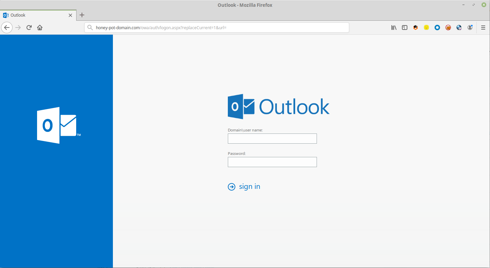
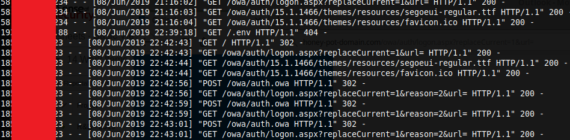
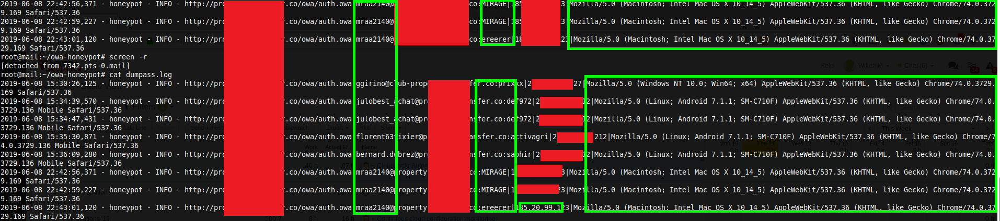

# owa-honeypot
A basic flask based Outlook Web Honey pot

## why?
Most corps have some form of OWA and I couldn't find an out of the box OWA only honeypot (I'm sure if I spent more than 2 minutes googling I probably would have found one) and I wanted to mess around with some ideas I have. So I spent some time putting this together, maybe it could help someone else :)

## requirements
python3 + flask

## how to install
git clone https://github.com/joda32/owa-honeypot.git
cd owa-honeypot
python3 -m venv env
source env/bin/activate
pip install -r requirements.txt

python owa_pot.py

## here be dragons!
In the code I basically start the flask dev server on port 80, that is a really bad idea if you want to run it on the internet. I have a todo to change that. :)

Anyway, it did work for what I wanted. I've added a crude write up here (https://joda32.github.io/2019/06/11/owa-plus-pastebin.html)

